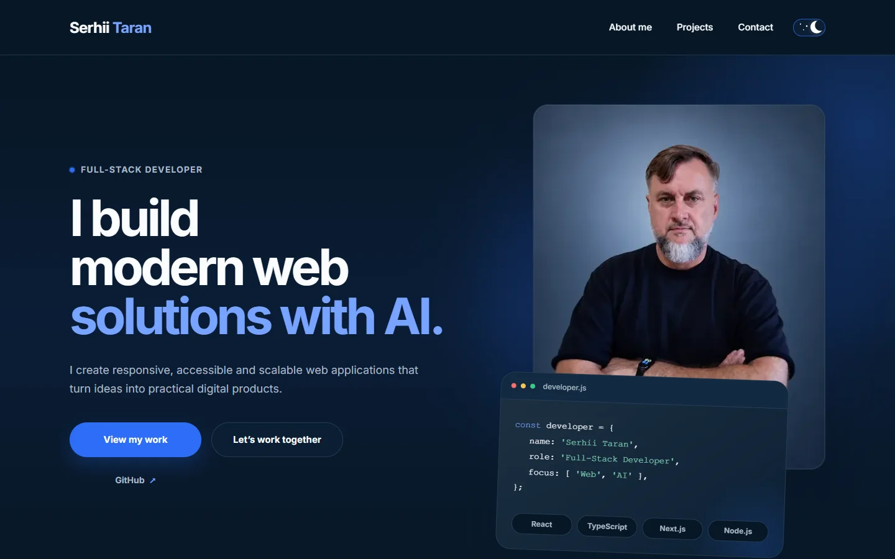

# Serhii Taran — Full-Stack Developer Portfolio

A responsive personal portfolio presenting my development experience, selected projects and approach to building practical web solutions.

I combine modern web development with a background in project management, retail operations and analytics. My focus is on clear interfaces, reliable functionality, maintainable code, AI-assisted workflows and useful process automation.

[Live Demo](https://serhii-taran-portfolio.vercel.app/) · [GitHub Profile](https://github.com/Serhii-Taran-dev)

## Preview

[](https://serhii-taran-portfolio.vercel.app/)

## Overview

This website was redesigned from a training project into a production-ready personal portfolio with an original visual system based on my brand identity.

It presents my professional background, current technical focus, selected projects, working principles and contact information through a responsive and accessible interface.

The project is built with semantic HTML, modern CSS and modular JavaScript without a frontend framework.

## Key Features

- Responsive, mobile-first layout
- Light and dark themes with saved user preference
- Automatic theme selection based on system preferences
- Accessible mobile navigation with keyboard support and focus management
- Semantic HTML and accessibility attributes
- Branded Hero and About Me presentation
- Core toolkit and current professional focus
- Selected project cards with live-demo and repository links
- Benefits section describing my working approach
- FAQ section with concise answers to common questions
- Data-driven reviews loaded from JSON
- Dynamically imported Swiper slider when verified reviews are available
- Automatic hiding of the Reviews section when no review data is available
- Contact form with client-side validation and asynchronous Formspree submission
- Loading, success and error states for form submission
- Responsive Hero and About images using `srcset` and `sizes`
- Lazy-loaded non-critical images
- Locally hosted Inter font files
- Dynamic footer year
- Branded favicon set
- Reduced-motion support
- SEO metadata and `robots.txt`

## Sections

1. Header and mobile navigation
2. Hero
3. About Me and Core Toolkit
4. Projects
5. Benefits
6. FAQ
7. Reviews — displayed when verified recommendations are available
8. Contact
9. Footer

## Tech Stack

| Category      | Technologies                               |
| ------------- | ------------------------------------------ |
| Markup        | HTML5                                      |
| Styling       | CSS3, custom properties, responsive layout |
| Logic         | JavaScript, ES modules, Fetch API          |
| UI library    | Swiper                                     |
| Fonts         | Inter, Fontsource                          |
| Form delivery | Formspree                                  |
| Tooling       | Vite, npm, Git, GitHub                     |
| Deployment    | Vercel                                     |

## Performance

Production Lighthouse audit:

| Category       | Mobile | Desktop |
| -------------- | -----: | ------: |
| Performance    |     98 |     100 |
| Accessibility  |    100 |     100 |
| Best Practices |    100 |     100 |
| SEO            |    100 |     100 |

Core performance metrics:

| Metric                   | Mobile | Desktop |
| ------------------------ | -----: | ------: |
| First Contentful Paint   |  1.7 s |   0.4 s |
| Largest Contentful Paint |  1.7 s |   0.4 s |
| Total Blocking Time      | 100 ms |    0 ms |
| Cumulative Layout Shift  |      0 |       0 |

> Lighthouse results may vary slightly depending on network conditions, device performance and server cache state.

## Getting Started

Clone the repository:

```bash
git clone https://github.com/Serhii-Taran-dev/serhii-taran-portfolio.git
```

Open the project directory:

```bash
cd serhii-taran-portfolio
```

Install the dependencies:

```bash
npm install
```

Start the development server:

```bash
npm run dev
```

Open the local URL displayed by Vite in your browser.

## Available Scripts

```bash
npm run dev
```

Starts the Vite development server.

```bash
npm run build
```

Creates an optimized production build in the `dist` directory.

```bash
npm run preview
```

Runs the production build locally for final verification.

## Reviews

The Reviews section is prepared for verified professional recommendations.

Review data is stored in:

```text
public/reviews.json
```

When the file contains an empty array, the section is hidden automatically and the Swiper library is not loaded. Once verified reviews are added, the cards and slider are initialized dynamically.

## Deployment

The project is deployed on Vercel:

[serhii-taran-portfolio.vercel.app](https://serhii-taran-portfolio.vercel.app/)

Every push to the `main` branch automatically creates a new production deployment.

## Project Status

The portfolio is complete, deployed and production-ready.

Responsive behavior, accessibility, performance, SEO, browser functionality and production resources have been manually verified.

## Contact

**Serhii Taran** — Full-Stack Developer

- GitHub: [Serhii-Taran-dev](https://github.com/Serhii-Taran-dev)
- Email: [serhii.taran.dev@gmail.com](mailto:serhii.taran.dev@gmail.com)
